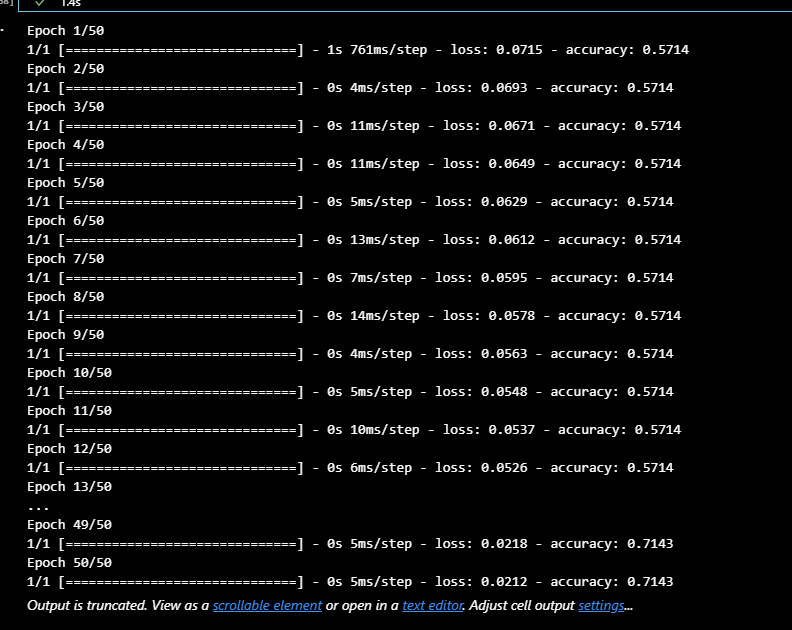
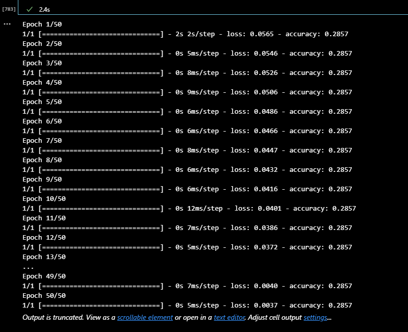

Neural_Network_CH13
Venture_Funding

 # Technology 
 These are the technologies the user can use to run the solution -- Jupyter notebook  -- Python -- Github -- To download the solution file. It's saved in githun as public
Test Data 
applicants_data.csv
 # Contributors 
 The solution is developed by Eyasu Alemu LinkdIn account -- https://www.linkedin.com/in/eyasu-a-684854112 Email -- Bekaqa01@gmail.com Phone Number -- 202 344 0733

Using the starter code file and the provided csv complete the following steps.
	Prepare the data for use on a neural network model.
	Compile and evaluate a binary classification model using a neural network.
	Optimize the neural network model.

1.	Prepare the data for use on a neural network model.
To make the data ready, the following steps are taken
o	Read the data from the csv file
o	Drop EIN and Name column
o	Encode data set

o	Create feature (x) and target (y)
o	Split the feature and target sets
o	Scale the feature data by using standardScaler
2.	Compile and evaluate a binary classification model using a neural network.

Create a deep neural network by assigning the number of input features, the number of layers, and the number of neurons on each layer using Tensorflow’s Keras.

 

3.	Optimize the neural network model.

•	Adjust the input data by dropping different features columns to ensure that no variables or outliers confuse the model.

•	Add more neurons (nodes) to a hidden layer.

•	Add more hidden layers.

•	Use different activation functions for the hidden layers.

•	Add to or reduce the number of epochs in the training regimen.
Alternative 1

Alternative 2

 

 

 
